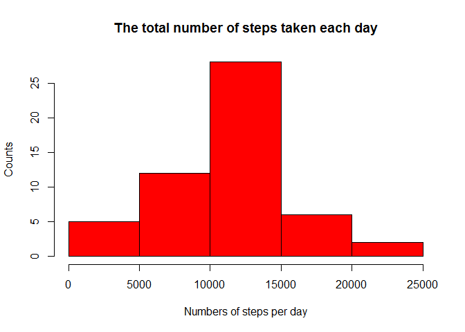
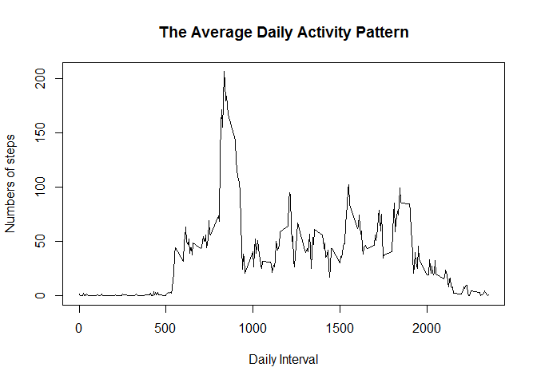
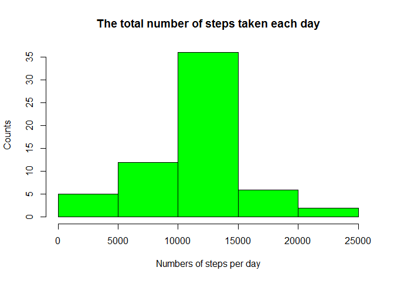

Reproducible Research: Peer Graded Project 1
============================================

        
## Loading and preprocessing the data


```r
data<-read.csv("C:/Users/Pin/Documents/activity.csv")
```

##  What is mean total number of steps taken per day?

* the total number of steps taken per day

```r
stepsPerday <- tapply(data$steps, data$date, sum)
```

* histogram of the total number of steps taken each day

```r
hist(stepsPerday, main = "The total number of steps taken each day", 
     xlab = "Numbers of steps per day", ylab = "Counts", col="red")
```

<!-- -->

* the mean and median of the total number of steps taken per day

```r
mean(stepsPerday, na.rm=TRUE)
```

```
## [1] 10766.19
```

```r
median(stepsPerday, na.rm=TRUE)
```

```
## [1] 10765
```

## What is the average daily activity pattern?

* The average daily acitivity pattern

```r
stepsPerInterval <- aggregate(x=list(averageSteps=data$steps), by=list(interval=data$interval), FUN=mean, na.rm=TRUE)
plot(stepsPerInterval$interval, stepsPerInterval$averageSteps, type = "l", main = ("The Average Daily Activity Pattern"), xlab="Daily Interval",
     ylab = "Numbers of steps")
```

<!-- -->

* maximum interval

```r
stepsPerInterval[which.max(stepsPerInterval$averageSteps), ]$interval
```

```
## [1] 835
```

## Imputing missing values

* the total number of missing values 

```r
sum(is.na(data$steps))
```

```
## [1] 2304
```

* Fill in the missing values,using the mean for that 5-minute interval

```r
newData<-data
for(i in 1:nrow(newData)) {
    if(is.na(newData[i, 1])) {
      replaceInterval<-newData[i,3]  
      newData[i,1]<-stepsPerInterval[stepsPerInterval$interval == replaceInterval, ]$averageSteps
      }
}
```

* histogram of the total number of steps taken each day for the new dataset.

```r
newStepsPerday <- tapply(newData$steps, newData$date, sum)
hist(newStepsPerday, main = "The total number of steps taken each day", 
     xlab = "Numbers of steps per day", ylab = "Counts", col="green")
```

<!-- -->

* the mean and median of the total number of steps taken per day for the new dataset.

```r
mean(newStepsPerday, na.rm=TRUE)
```

```
## [1] 10766.19
```

```r
median(newStepsPerday, na.rm=TRUE)
```

```
## [1] 10766.19
```

* Do these values differ from the estimates from the first part of the assignment? What is the impact of imputing missing data on the estimates of the total daily number of steps?

The mean value is the same because I use the mean value for that particular 5-min interval to replace the missing value. The median value differs from the original data, with a small increase.

## Are there differences in activity patterns between weekdays and weekends?

* Create a new factor variable in the dataset with two levels - "weekday" and "weekend"

```r
newData$date<-as.Date(newData$date)
newData$day <- factor(weekdays(newData$date) %in% c("Saturday","Sunday"), 
               labels=c("weekday","weekend"), ordered=FALSE)
```

* Activity patterns between weekdays and weekends

```r
NewStepsPerInterval <- aggregate(steps ~ interval + day, newData, mean)
library(lattice)
xyplot(steps ~ interval | factor(day), data = NewStepsPerInterval, aspect = 1/2, 
       type = "l")
```

<!-- -->
